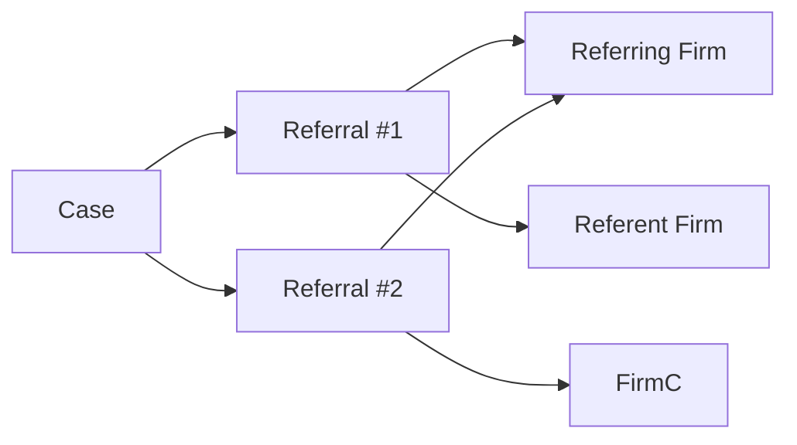

## Objects

- **Case** – Primary record with title, jurisdiction, and client details.
- **Referral** – A case handoff from one firm to another. A case can have multiple referrals (re-referrals).
- **Base Case** – The canonical case shared across referrals.



## Statuses

Common statuses include:

- `draft`
- `sent`
- `under_evaluation`
- `investigating`
- `signed`
- `rejected`
- `closed`

<Tip>
Bulk updates are restricted to active referrals (non-terminal states).
</Tip>

## Permissions

- **Referring firm** – Owns initial creation. Can edit before acknowledgment and limited fields after.
- **Receiving firm** – Can update notes after acknowledgment.
- **System admin** – Full control across firms.

## Re-Refer logic

- Only the owner/referring firm of the base case can re-refer.
- Requires an active relationship between firms.
- `POST /api/v1/cases/{id}/re-refer` creates a new referral record with incremented `sequenceNumber`.

## Error Handling

All error responses follow a consistent format:

```json
{
  "success": false,
  "error": {
    "code": "validation_error",
    "message": "Human-readable message",
    "details": []
  },
  "message": "Optional additional context"
}
```

Key error codes:

- `validation_error` - Invalid request input or validation error
- `resource_not_found` - Resource not found
- `permission_denied` - Insufficient permissions or action not allowed
- `no_token`, `token_invalid`, `token_expired` - Authentication failures
- `rate_limited_email`, `rate_limited_ip` - Rate limiting exceeded

Standard HTTP status codes:
- `400` - Bad Request (validation errors)
- `401` - Unauthorized (authentication required)
- `403` - Forbidden (insufficient permissions)
- `404` - Not Found (resource doesn't exist)

