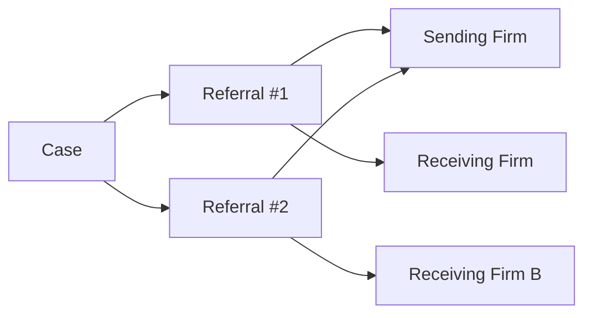

## Two perspectives

The Public API exposes every case through the lens of the firm holding the API key:

- **Sent Cases** -- cases your firm created and sent to another firm (sender perspective).
- **Received Referrals** -- referrals another firm sent to you (receiver perspective).

Both perspectives share the same underlying data, but each returns only the fields and actions relevant to that role. See the endpoint examples for full request/response details:

- [Sent Cases](/api-reference/examples/sent-cases)
- [Received Referrals](/api-reference/examples/received-referrals)
- [Referrals (lifecycle actions)](/api-reference/examples/referrals)

## Objects

- **Case** -- Primary record containing title, jurisdiction, case type, and client details.
- **Referral** -- A case handoff from a sending firm to a receiving firm. A single case can have multiple referrals (re-referrals), each with its own status and lifecycle.
- **Base Case** -- The canonical case shared across all of its referrals.


```mermaid
flowchart LR
  Case --> Referral1[Referral #1]
  Case --> Referral2[Referral #2]
  Referral1 --> FirmA[Sending Firm]
  Referral1 --> FirmB[Receiving Firm]
  Referral2 --> FirmA
  Referral2 --> FirmC[Receiving Firm B]
```

## Statuses

Every referral progresses through a defined set of statuses. The full enum is:

| Status | Description |
|---|---|
| `draft` | Case created but not yet sent to a receiving firm. |
| `sent` | Referral dispatched to the receiving firm. |
| `received` | Receiving firm has acknowledged the referral. |
| `under_evaluation` | Receiving firm is evaluating the case. |
| `investigating` | Active investigation is underway. |
| `signed` | Client retainer has been signed. |
| `in_litigation` | Case is in active litigation. |
| `closing` | Case is in the closing process. |
| `won` | Case resolved with a favorable outcome. |
| `lost` | Case resolved with an unfavorable outcome. |
| `rejected` | Receiving firm declined the referral. |
| `withdrawn` | Sending firm withdrew the referral. |
| `closed` | Case is fully closed. |

### Closing status

When a referral reaches a terminal state through the close action, a `closingStatus` is required:

| Closing Status | Meaning |
|---|---|
| `won_settled` | Case was won or settled. |
| `lost` | Case was lost. |
| `no_longer_pursuing` | Firm elected to stop pursuing the case. |

### Status flow

```
draft -> sent -> received -> under_evaluation -> investigating -> signed -> in_litigation -> closing -> closed
                                                                                                 \-> won
                                                                                                 \-> lost
        sent -> rejected   (by receiving firm)
        sent -> withdrawn  (by sending firm)
```

<Tip>
Use the `GET /sent-cases/{id}/available-statuses` or `GET /received-referrals/{id}/available-statuses` endpoint to discover which transitions are valid for the current state before attempting a status change.
</Tip>

## Permissions

- **Sending firm** -- Owns initial case creation. Can edit sender-owned fields (`tier`, `source`) after the case is sent. Can withdraw a referral.
- **Receiving firm** -- Can update notes, financial estimates, phase, lead attorney, and other referral fields after acknowledgment. Can reject, advance, or close a referral.
- **Both firms** -- Can read case details and referral status history through their respective perspective endpoints.

## Refer and re-refer logic

A referral is created when a sending firm sends a draft case to a receiving firm.

- `POST /sent-cases/{id}/refer` sends a draft case to a receiving firm or creates a new referral on an existing case (re-refer). Each new referral receives an incremented `sequenceNumber`.
- Only the sending firm (owner of the base case) can refer or re-refer.
- An active network relationship between the sending and receiving firms is required.
- The referrals sub-resource (`/cases/{baseCaseId}/referrals`) provides granular lifecycle actions on individual referrals: acknowledge, begin-investigating, sign, start-litigation, close, reject, and withdraw.

```bash
# Create a case as a draft
POST /sent-cases

# Send it to a receiving firm (initial refer)
POST /sent-cases/{id}/refer
  { "referentFirmId": "...", "notes": "..." }

# Later, re-refer the same case to a different firm
POST /sent-cases/{id}/refer
  { "referentFirmId": "<different-firm-id>", "notes": "..." }
```

## Error handling

All error responses follow a consistent envelope:

```json
{
  "error": {
    "code": "validation_error",
    "message": "Human-readable description of the problem"
  },
  "meta": {
    "requestId": "req_8a2b3c4d5e6f7890",
    "timestamp": "2026-03-31T16:00:00.000Z"
  }
}
```

### Key error codes

| Code | Meaning |
|---|---|
| `validation_error` | Invalid request input or failed validation rules. |
| `resource_not_found` | The referenced resource does not exist or is not visible to the caller. |
| `permission_denied` | Insufficient permissions or the action is not allowed for this firm/role. |
| `invalid_api_key` | The `X-API-Key` header is missing, malformed, or does not match an active key. |
| `insufficient_tier` | The API key's tier does not grant access to this endpoint (e.g., a `read_only` key calling a `standard` endpoint). |
| `rate_limited` | Too many requests -- back off and retry. |

### Standard HTTP status codes

| Status | Meaning |
|---|---|
| `400` | Bad Request -- validation errors, invalid state transitions, or malformed input. |
| `401` | Unauthorized -- missing or invalid API key. |
| `403` | Forbidden -- the key is valid but lacks permission for this action or resource. |
| `404` | Not Found -- the resource ID does not exist or is not accessible. |
| `409` | Conflict -- duplicate resource or conflicting state (e.g., active referral already exists to the same firm). |
| `429` | Too Many Requests -- rate limit exceeded. |
